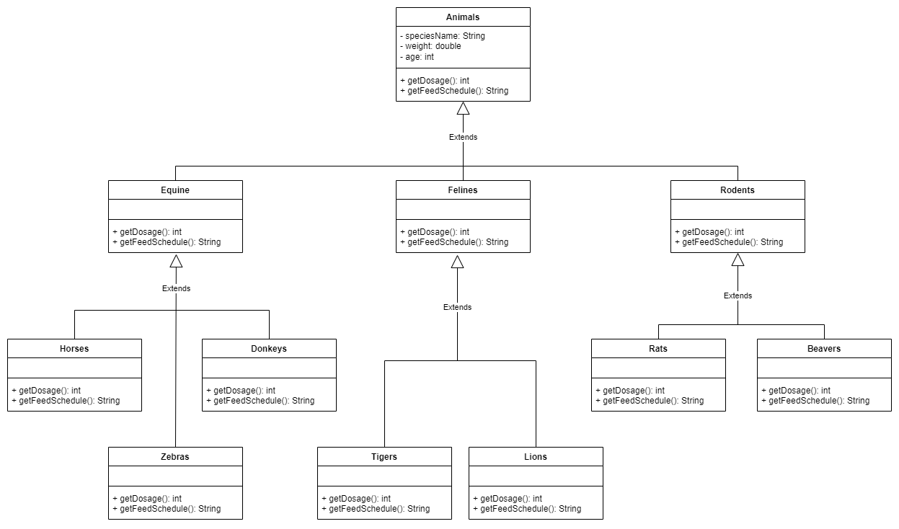

## We design a system using the Polymorphism model to track information about animals in a zoo.

* Animals: It is characterized in species in the following groups.
  * Equine (horses, zebras, donkeys, etc.)
  * Felines (tigers, lions, etc.),
  * Rodents (rats, beavers, etc.)

* Most of the information stored about animals is the same for all groupings.
  * species name
  * weight
  * age, etc.
  
* The system should also be able to get the dosage of specific drugs for each animal => getDosage()

* System should be able to calculate Feed times => getFeedSchedule()

* The logic for the system to perform these functions will be different for each grouping. For example, the feeding algorithm will be different for horses and different for tigers.

## UML Diagram:

